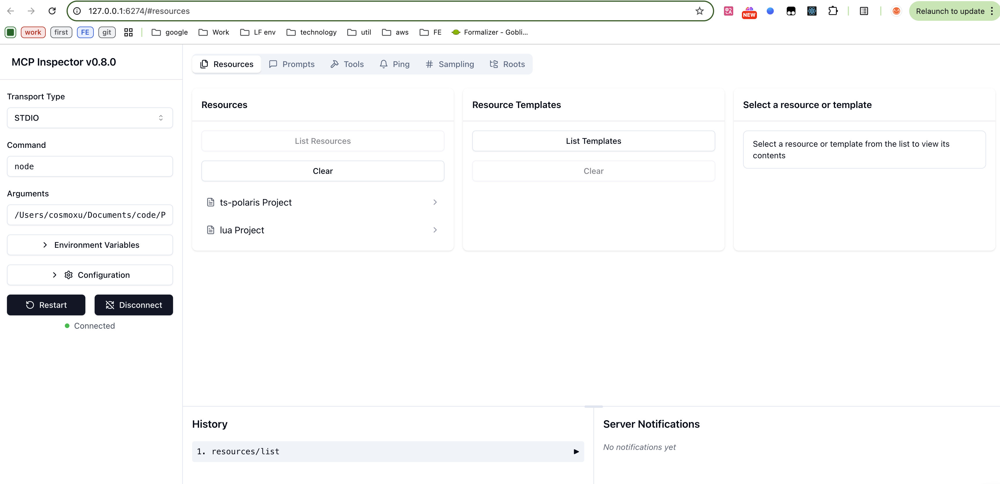
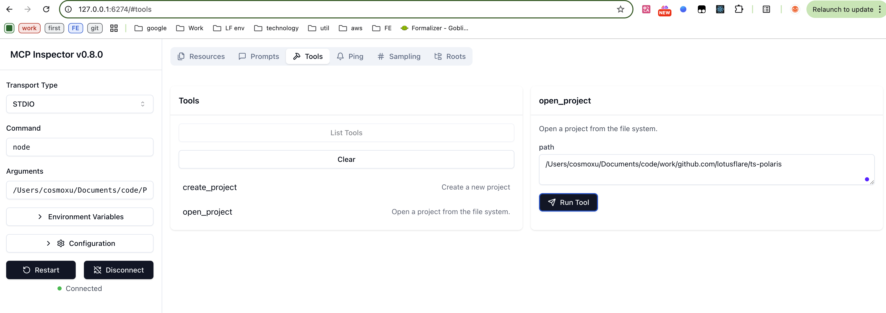
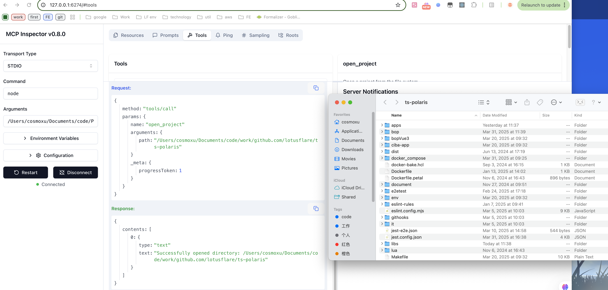

# demo-mcp-server MCP Server

A Model Context Protocol server

A TypeScript-based MCP server demonstrating core concepts through a ​project management system. Key components:

​Resources: Query projects via URIs and hierarchical paths
​Tools: Create and open projects programmatically


>goal: Tell AI to open the project, and AI will call MCP Server to open the project and run it locally

## Features

### Resources
- List and access projects via `project://` URIs
- Each project has a project name, path and metadata
- Plain text mime type for simple content access


### Tools
- `create_project` - Create new text projects
  - Takes title and content as required parameters
  - Stores project in server state
- `open_project` - open project





## Development

- Install dependencies:
```bash
npm install
```

- Build the server:
```bash
npm run build
```

- For development with auto-rebuild:
```bash
npm run watch
```


- Debugging

Since MCP servers communicate over stdio, debugging can be challenging. We recommend using the [MCP Inspector](https://github.com/modelcontextprotocol/inspector), which is available as a package script:

```bash
npx @modelcontextprotocol/inspector node .../demo-mcp-server/build/index.js
```

The Inspector will provide a URL to access debugging tools in your browser.


## Installation

To use with Claude Desktop, add the server config:

On MacOS: `~/Library/Application Support/Claude/claude_desktop_config.json`
On Windows: `%APPDATA%/Claude/claude_desktop_config.json`

```json
{
    "demo-mcp-service": {
      "command": "/usr/local/bin/node",
      "args": [
        ".../demo-mcp-server/build/index.js"
      ],
      "disabled": false,
      "autoApprove": []
    }
}
```

